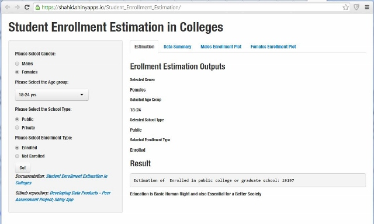

## Introduction

Education is one of the Basic Human Right and also Essential for a Better and Prosper Society.

Student Enrollment Estimation in Colleges (SEEC) is a basic application to calculate the estimation of enrolled/not enrolled student in Colleges.

There are 4 inputs that are required for estimation. On the provided data, SEE will estimate the result. These inputs are:
 Gender, Age, School Type, and Enrollment Type

SEEC application is consist of 4 parts.

1. Estimation - Computes the Estimate on the provided data.
2. Data Summary - Data representation
3. Male Enrollment Plot - enrolled/not-enrolled Comparison Chart
4. Female Enrollment Plot - enrolled/not-enrolled Comparison Chart

--- .class #id 

##  Shiny App: Student Enrollment Estimation in Colleges (SEEC)

    

   
[Student Enrollment Estimation in Colleges App Hosted by shinyapps.io](https://shahid.shinyapps.io/Student_Enrollment_Estimation)  

---

## Males Enrollment Plot

<iframe src="assets/img/m1.html", width=100%, height=600></iframe>

---

## Female Enrollment Plot

<iframe src="assets/img/f1.html", width=100%, height=600></iframe>

